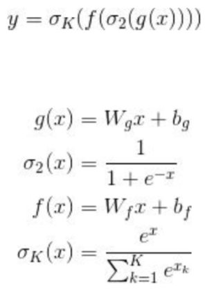

# jim-emacs-fun-hylisp-keras 我的大脑从来不记忆公式,只是记忆书上不存在的Lisp,将哲学保存到每一个Lisp原子里面
* 从Hack计算代码到计算论文
* 用函数式LISP来表达问题,问题变得清晰很多
* 用李小龙和乔布斯的哲学推导吸引Hack计算代码: 首先你是个哲学家,然后才是一个Lisp程序员

- [jim-emacs-fun-hylisp-keras 我的大脑从来不记忆公式,只是记忆书上不存在的Lisp,将哲学保存到每一个Lisp原子里面](#jim-emacs-fun-hylisp-keras-%E6%88%91%E7%9A%84%E5%A4%A7%E8%84%91%E4%BB%8E%E6%9D%A5%E4%B8%8D%E8%AE%B0%E5%BF%86%E5%85%AC%E5%BC%8F%E5%8F%AA%E6%98%AF%E8%AE%B0%E5%BF%86%E4%B9%A6%E4%B8%8A%E4%B8%8D%E5%AD%98%E5%9C%A8%E7%9A%84lisp%E5%B0%86%E5%93%B2%E5%AD%A6%E4%BF%9D%E5%AD%98%E5%88%B0%E6%AF%8F%E4%B8%80%E4%B8%AAlisp%E5%8E%9F%E5%AD%90%E9%87%8C%E9%9D%A2)
    - [Elisp化](#elisp%E5%8C%96)
        - [hy2py3repl2](#hy2py3repl2)
    - [Hylisp function programming list](#hylisp-function-programming-list)
        - [import](#import)
        - [Input](#input)
        - [summary](#summary)
        - [shape](#shape)
        - [神经网络的黑盒不黑get_layer & layers: 就像纯函数一样调用每个层或模型或映射或矩阵或函数](#%E7%A5%9E%E7%BB%8F%E7%BD%91%E7%BB%9C%E7%9A%84%E9%BB%91%E7%9B%92%E4%B8%8D%E9%BB%91get_layer--layers-%E5%B0%B1%E5%83%8F%E7%BA%AF%E5%87%BD%E6%95%B0%E4%B8%80%E6%A0%B7%E8%B0%83%E7%94%A8%E6%AF%8F%E4%B8%AA%E5%B1%82%E6%88%96%E6%A8%A1%E5%9E%8B%E6%88%96%E6%98%A0%E5%B0%84%E6%88%96%E7%9F%A9%E9%98%B5%E6%88%96%E5%87%BD%E6%95%B0)
        - [步步为营保存层,层和模型嫁接迁移](#%E6%AD%A5%E6%AD%A5%E4%B8%BA%E8%90%A5%E4%BF%9D%E5%AD%98%E5%B1%82%E5%B1%82%E5%92%8C%E6%A8%A1%E5%9E%8B%E5%AB%81%E6%8E%A5%E8%BF%81%E7%A7%BB)
        - [Dense softmax](#dense-softmax)
        - [compile](#compile)
        - [optimizer](#optimizer)
        - [predict黑盒映射](#predict%E9%BB%91%E7%9B%92%E6%98%A0%E5%B0%84)
        - [fit拟合数据](#fit%E6%8B%9F%E5%90%88%E6%95%B0%E6%8D%AE)
        - [evaluate](#evaluate)
        - [get_weights & set_weights & load_weights & save_weights](#get_weights--set_weights--load_weights--save_weights)
        - [np.array张量0D~3D](#nparray%E5%BC%A0%E9%87%8F0d3d)
        - [slice张量](#slice%E5%BC%A0%E9%87%8F)
        - [张量运算 AND OR (like 集合运算)](#%E5%BC%A0%E9%87%8F%E8%BF%90%E7%AE%97-and-or-like-%E9%9B%86%E5%90%88%E8%BF%90%E7%AE%97)
        - [夹角余弦Cosine](#%E5%A4%B9%E8%A7%92%E4%BD%99%E5%BC%A6cosine)
        - [分布式表示最大的问题在于: 连接connect的问题,连接多个层的问题,充分利用各种细胞的简单优势计算](#%E5%88%86%E5%B8%83%E5%BC%8F%E8%A1%A8%E7%A4%BA%E6%9C%80%E5%A4%A7%E7%9A%84%E9%97%AE%E9%A2%98%E5%9C%A8%E4%BA%8E-%E8%BF%9E%E6%8E%A5connect%E7%9A%84%E9%97%AE%E9%A2%98%E8%BF%9E%E6%8E%A5%E5%A4%9A%E4%B8%AA%E5%B1%82%E7%9A%84%E9%97%AE%E9%A2%98%E5%85%85%E5%88%86%E5%88%A9%E7%94%A8%E5%90%84%E7%A7%8D%E7%BB%86%E8%83%9E%E7%9A%84%E7%AE%80%E5%8D%95%E4%BC%98%E5%8A%BF%E8%AE%A1%E7%AE%97)
        - [基于梯度的优化](#%E5%9F%BA%E4%BA%8E%E6%A2%AF%E5%BA%A6%E7%9A%84%E4%BC%98%E5%8C%96)
        - [斜率->导数->梯度(张量运算的导数)](#%E6%96%9C%E7%8E%87-%E5%AF%BC%E6%95%B0-%E6%A2%AF%E5%BA%A6%E5%BC%A0%E9%87%8F%E8%BF%90%E7%AE%97%E7%9A%84%E5%AF%BC%E6%95%B0)
        - [随机梯度SGD](#%E9%9A%8F%E6%9C%BA%E6%A2%AF%E5%BA%A6sgd)
    - [Examples实例对比](#examples%E5%AE%9E%E4%BE%8B%E5%AF%B9%E6%AF%94)
        - [seq2seq model](#seq2seq-model)
        - [extract model](#extract-model)


### Elisp化

##### hy2py3repl2
```bash
hy2py3repl2 () {
	rlwrap sh -c 'while read line; do pycode=`echo "$line" | hy2py3`; echo "翻译:"$pycode; echo "执行:"; python -c "print($pycode)"; echo "------------" ; done'
}
#  ------------
#  (-> 1 (+ 2) (- 1) (/ 4))
#  翻译:(1 + 2 - 1) / 4
#  执行:
#  0.5
#  ------------
```

### Hylisp function programming list

##### import

```clojure
(import
 [tensorflow :as tf]
 keras
 [keras [backend :as K]]
 [keras.models [Model load_model]]
 [numpy :as np]
 [keras [losses]]
 [keras.layers [Input LSTM GRU Dense Embedding Bidirectional BatchNormalization Lambda Activation]])
```

##### Input

```clojure
(Input :shape (, None) :name "Decoder-Input")
;;=> <tf.Tensor 'Decoder-Input_2:0' shape=(?, ?) dtype=float32>
(Input :shape (, 11) :name "Encoder-Input")
;;=> <tf.Tensor 'Encoder-Input_1:0' shape=(?, 11) dtype=float32>
```

##### summary

```clojure
((. decoder_model summary))
```

##### shape

```clojure
(import [keras.datasets [mnist]])
(setv (, (, train_images train_labels) (, test_images test_labels)) ((. mnist load_data)))

(. train_images shape) ;;=> (60000, 28, 28)
(len train_labels) ;;=> 60000
train_labels ;;=> array([5, 0, 4, ..., 5, 6, 8], dtype=uint8)

(. test_images shape) ;;=> (10000, 28, 28)
(len test_labels) ;;=> 10000
test_labels ;;=> array([7, 2, 1, ..., 4, 5, 6], dtype=uint8)

```

##### 神经网络的黑盒不黑get_layer & layers: 就像纯函数一样调用每个层或模型或映射或矩阵或函数
* get_layer
```clojure
;; 拆出来层当模型来用,黑盒映射的白盒化
(setv model_get_layer (fn [name] (-> model (.get_layer name))))

;;添加一个 x -> x^2 层
(model.add (Lambda (fn [x] (** x 2))))

(** (np.array [[[1 8] [3 5]] [[9 7] [6 4]]]) 2)
;; => array([[[ 1, 64],
;;         [ 9, 25]],
;;        [[81, 49],
;;         [36, 16]]])

(K.eval
 ((Lambda (fn [x] (** x 2)))
  (K.variable
   (np.array [[[1 8] [3 5]] [[9 7] [6 4]]]))))
;;=> <tf.Tensor 'lambda_8/pow:0' shape=(2, 2, 2) dtype=float32>
;;K.eval之后=>
;; array([[[  1.,  64.],
;;        [  9.,  25.]],
;;       [[ 81.,  49.],
;;        [ 36.,  16.]]], dtype=float32)
```
* layers
```clojure
(import [keras.applications.vgg16 [VGG16]]
        [keras.models [Model]]
        [keras.preprocessing [image]]
        [keras.applications.vgg16 [preprocess_input]]
        [numpy :as np])

;; github.com/fchollet/deep-learning-models/releases/download/v0.1/vgg16_weights_tf_dim_ordering_tf_kernels.h5
(setv base_model (VGG16 :weights "imagenet" :include_top True))

;; 先打印所有的layers出来看,以便get_layer单独取出层
(for [(, i layer) (enumerate base_model.layers)]
  (print i ": " layer.name ", " layer.input_shape ", " layer.output_shape))
;; 0 :  input_1 ,  (None, 224, 224, 3) ,  (None, 224, 224, 3)
;; 1 :  block1_conv1 ,  (None, 224, 224, 3) ,  (None, 224, 224, 64)
;; ...
;; 21 :  fc2 ,  (None, 4096) ,  (None, 4096)
;; 22 :  predictions ,  (None, 4096) ,  (None, 1000)

;;keras get weights of dense layer
(setv (, weights biases)
      (-> base_model (.get_layer "fc2") .get_weights))
;; weights=> weights.shape (4096, 4096)
;; biases=> biases.shape (4096,)
;; array([ 0.64710701,  0.48036072,  0.58551109, ...,  0.50245267,
;;         0.41782504,  0.66609925], dtype=float32)

;; 单个层的特征提取predict
(setv mmodel (Model :input base_model.input ;;<tf.Tensor 'input_2:0' shape=(?, 224, 224, 3) dtype=float32>
                    :output (-> base_model (.get_layer "block4_pool") (. output)) ;;<tf.Tensor 'block4_pool_1/MaxPool:0' shape=(?, 14, 14, 512) dtype=float32>
                    ))
(setv features
      (->
       "cat.jpg"
       (image.load_img :target_size (, 224 224))
       (image.img_to_array)
       (np.expand_dims :axis 0)
       (preprocess_input)
       (mmodel.predict)))

(-> features first len) ;;=> 14
(-> features (. shape)) ;; => (1, 14, 14, 512)
(-> features first first (. shape)) ;;=> (14, 512)

```

* 层的本质是函数



```clojure
(setv inputs (Input :shape (, 784)))
(->
 inputs
 ((Dense 32))
 ((Activation K.sigmoid))
 ((Dense 10))
 ((Activation K.softmax))
 ((fn [predictions]
    (Model :inputs inputs :outputs predictions)))
 (.compile :loss keras.losses.categorical_crossentropy :optimizer (keras.optimizers.Adam)))

```

##### 步步为营保存层,层和模型嫁接迁移

```clojure
;; 保存层权重和numpy每一步结果,模型的每次结果

(np.save "max_emb_dim500_v2.npy" max_hs)

(seq2seq_Model.save "code_summary_seq2seq_model.h5")
(load_model "code_summary_seq2seq_model.h5")

(model.load_weights weights_path)
```

##### Dense softmax

```clojure
;; 密集连接(全连接):
;; 最后一层是一个14002路的softmax层, 返回一个由14002个概率值(总和为1)组成的数组,
;; 每个概率值表示 当前代码向量 属于14002个句向量类别中某一个的概率
;; keras.activations.softmax or K.softmax
(Dense 14002 :activation keras.activations.softmax :name "Final-Output-Dense")
(fn [data]
  (setv (, dec_bn2 _) data)
  ((model_get_layer "Final-Output-Dense") dec_bn2))
```

##### compile

```clojure
;; sparse_categorical_crossentropy 是整数(sparse)标签应该遵循分类编码
(seq2seq_Model.compile :optimizer (optimizers.Nadam :lr 0.00005)
                       :loss "sparse_categorical_crossentropy")
```
##### optimizer
```clojure
(model.compile :optimizer (SGD) :loss keras.losses.categorical_crossentropy)
```
##### predict黑盒映射

```clojure
(encoder_model.predict raw_tokenized)
(decoder_model.predict [state_value, encoding])
```
##### fit拟合数据

```clojure
(seq2seq_Model.fit [encoder_input_data decoder_input_data]
                   (np.expand_dims decoder_target_data, -1))
```

##### evaluate

```clojure
(setv (, test_loss test_acc) (network.evaluate test_images test_labels))
;;=> test_acc: 0.9785
```
##### get_weights & set_weights & load_weights & save_weights
```clojure
(->
 (tf.placeholder tf.float32 [None 10] :name "input_x")
 ;; OR: (K.placeholder [None 10] :name "input_x")
 ((fn [input_x]
    (setv dense1 (Dense 10 :activation K.relu))
    (dense1 input_x) ;;=> <tf.Tensor 'dense_2/Relu:0' shape=(?, 10) dtype=float32>
    dense1))
 (.get_weights)
 (first)
 len
 ) ;;=> 10
```
##### np.array张量0D~3D

```clojure
(import [numpy :as np])
(-> 12 np.array (. ndim)) ;; 0D, ()
(-> [1 3 5 8] np.array (. ndim)) ;;=> 1D, (4,)
(-> [[1 3] [5 8]] np.array (. ndim)) ;;=> 2D, (2, 2)
(-> [[[1 2] [3 5]] [[9 7] [6 4]]] np.array (. ndim)) ;;=> 3D , (2, 2, 2)
```

##### slice张量
```clojure
(-> train_images (get 4) (. shape)) ;;=> (28, 28)
(-> train_images (get (slice 10 100)) (. shape)) ;;=> (90, 28, 28)
;; 所有图像右下角选出14x14的像素区域
(-> train_images (get [(slice None) (slice 14 None) (slice 14 None)]) (. shape)) ;;=> (60000, 14, 14)
;; 所有图像中心裁剪出14x14的像素区域
(-> train_images (get [(slice None) (slice 7 -7) (slice 7 -7)]) (. shape)) ;;=> (60000, 14, 14)

```
##### 张量运算 AND OR (like 集合运算)
* 逐元素relu & add运算
```clojure
(K.eval
 (K.relu (np.array [[[1 8] [3 5]] [[9 7] [6 4]]])
         :alpha 0.0 :max_value 5))
;;=> <tf.Tensor 'Relu:0' shape=(2, 2, 2) dtype=int64>
;;K.eval => array([[[1, 5],
;;        [3, 5]],
;;       [[5, 5],
;;        [5, 4]]])

(np.add (np.array [[[1 8] [3 5]] [[9 7] [6 4]]])
        (np.array [[[2 8] [5 2]] [[9 8] [6 4]]]))
;; array([[[ 3, 16],
;;         [ 8,  7]],
;;        [[18, 15],
;;         [12,  8]]])
```
* maximum广播
```clojure
(np.maximum (np.array [[[1 8] [3 5]] [[9 7] [6 4]]]) 0.0)
;;array([[[ 1.,  8.],
;;        [ 3.,  5.]],
;;       [[ 9.,  7.],
;;        [ 6.,  4.]]])
```
* dot点积
```clojure
(np.dot (np.array [[[1 8] [3 5]] [[9 7] [6 4]]])
        (np.array [[[2 8] [5 2]] [[9 8] [6 4]]]))
;; array([[[[ 42,  24],
;;          [ 57,  40]],
;;         [[ 31,  34],
;;          [ 57,  44]]],
;;        [[[ 53,  86],
;;          [123, 100]],
;;         [[ 32,  56],
;;          [ 78,  64]]]])
```
* reshape张量编写
```clojure
(. (train_images.reshape (, 60000 (* 28 28))) shape) ;;=> (60000, 784)
(/ (train_images.astype "float32") 255)

(->
 [[0. 1.]
  [2. 3.]
  [4. 5.]]
 np.array
 (.reshape (, 2 3)))
;; array([[ 0.,  1.,  2.],
;;        [ 3.,  4.,  5.]])

(-> (np.zeros (, 300 200))
    np.transpose
    (. shape))
;; (200, 300)
```
* argmax沿轴axis最大值的索引
```clojure
(np.argmax (model.predict im))

(setv a (-> (np.arange 6)
            (.reshape 2 3)))
;;array([[0, 1, 2],
;;       [3, 4, 5]])
(np.argmax a) ;;=>  5
(np.argmax a :axis 0) ;列=> array([1, 1, 1])
(np.argmax a :axis 1) ;行=> array([2, 2])
(-> (np.arange 6)
    ((fn [b]
       (setv (get b 1) 5)
       b)) ;;=> array([0, 5, 2, 3, 4, 5])
    np.argmax) ;;=> 1
```
* negative 求相反数
```clojure
(np.negative [1. -1.]) ;;=> array([-1.,  1.])
```
* expand_dims在第'axis'维，加一个维度出来，原先的'维'，推到右边去
```clojure
(np.expand_dims im :axis 0)

(-> (np.array [1 2 3])
    ;;(np.expand_dims  :axis 0) ;;=>array([[1, 2, 3]])
    ;;(np.expand_dims  :axis 1) ;;=> array([[1], [2], [3]])
    ;;(np.expand_dims :axis 2) ;;=> array([[1], [2], [3]])
    (np.expand_dims :axis 3) ;; => array([[1], [2], [3]])
    )

(-> (np.array [[1 2 3] [4 5 6]])
    ;;(np.expand_dims :axis 0) ;; array([[[1, 2, 3], [4, 5, 6]]])
    ;;(np.expand_dims :axis 1) array([[[1, 2, 3], [4, 5, 6]]])
    ;; (np.expand_dims :axis 2) ;;=> array([[[1] [2] [3]] [[4] [5] [6]]])
    ;;(np.expand_dims :axis 3) ;;=> array([[[1] [2] [3]] [[4] [5] [6]]])
    (np.expand_dims :axis 4) ;;=> array([[[1] [2] [3]] [[4] [5] [6]]])
    )

```
* squeeze
```clojure
(np.squeeze out)
```
* argsort大小排序的索引
```clojure
(-> [3 1 2]
    np.array
    np.argsort) ;;=> array([1, 2, 0])
```
* argpartition(arg*都是返回索引的): 找出第 k 大的数的位置，以及大于 k (排在k后面)和 小于 k (排在k前面)的数的位置
```clojure
(setv a (np.array [9 4 4 3 3 9 0 4 6 0]))

(-> a
    (np.argpartition 6)
    ;; or (np.argpartition :kth 6)
    ((fn [ids] (get a ids)))) ;;=> array([0, 0, 3, 3, 4, 4, 4, 9, 6, 9])

;;Top5
(-> a
    (np.argpartition -5)
    (get (slice -5 None))
    ((fn [ids] (get a ids)))) ;;=> array([4, 4, 9, 6, 9])
```
* 数组拼接extend & append & concatenate
```clojure
(setv a (np.array [[1 2 3] [4 5 6]])
      b (np.array [[11 21 31] [7 8 9]]))
(np.concatenate (, a b) :axis 0)
;;array([[ 1,  2,  3],
;;       [ 4,  5,  6],
;;       [11, 21, 31],
;;       [ 7,  8,  9]])
(np.concatenate (, a b) :axis 1)
;;array([[ 1,  2,  3, 11, 21, 31],
;;       [ 4,  5,  6,  7,  8,  9]])
(np.concatenate (, a b) :axis 2) ;;IndexError: axis 2 out of bounds [0, 2)

(np.append a b) ;;=> array([ 1,  2,  3,  4,  5,  6, 11, 21, 31,  7,  8,  9])
(np.append a b :axis None) ;;=> array([ 1,  2,  3,  4,  5,  6, 11, 21, 31,  7,  8,  9])
(np.append a b :axis 1)
;;array([[ 1,  2,  3, 11, 21, 31],
;;       [ 4,  5,  6,  7,  8,  9]])

(setv list_a (list a)) ;;=> [array([1, 2, 3]), array([4, 5, 6])]
(.extend
 list_a
 (list b)) ;;=> [array([1, 2, 3]), array([4, 5, 6]), array([11, 21, 31]), array([7, 8, 9])]

```
##### 夹角余弦Cosine


```clojure
(setv vector1 (np.array [1 2 3])
      vector2 (np.array [4 5 6]))

(np.divide
 (np.dot vector1 vector2)
 (np.multiply (np.linalg.norm vector1) (np.linalg.norm vector2)))
;;=> 0.97463184619707621

```
##### 分布式表示最大的问题在于: 连接connect的问题,连接多个层的问题,充分利用各种细胞的简单优势计算
* 就像你要获得pdf的C-g数据一样,不能像网页一样获得,但是pdf可以用苹果笔来写,网页却不能
* 合乎逻辑的想象力->假设->Repl的速度证明:「在每一系统的探索中，存在第一原理，是一个最基本的命题或假设，不能被省略或删除，也不能被违反。」(第一原理)
```clojure

```
##### 基于梯度的优化
```clojure
;; W权重(weight,可训练参数: kernel)和b偏置(biase属性)是张量为该层的属性
(K.relu (+ b (K.dot W input)))
;; 1. W权重由目标函数loss去更新
;; 2. 在训练样本上运行此网络层(前向传播),得到预测值,与原始值对比
```
##### 斜率->导数->梯度(张量运算的导数)
* 斜率->导数
```clojure
(setv (f x) y)
(setv (f x epsilon-x) (+ y epsilon-y))
(setv epsilon-y (* a epsilon-x)) ;;f近似为a的线性函数=>
(setv (f x epsilon-x) (+ y (* a epsilon-x)))
(setv (f_derivative x) a)
```
* 梯度gradient
```clojure
;; *采用代码实例化来表达抽象公式*
(setv y-pred (K.dot W x))
(setv loss-value (keras.losses.categorical_crossentropy y-pred y))
(setv loss-value (f W))
(setv W1 (- W0 (* step ((gradient f) W0))))
;; 1. W1是W的当前值
;; 2. 张量((gradient f) W0)是在W0点的导数,形状和W相同: 函数(setv (f W) loss-value)在W0的导数,或可以表示(f W)在W0附近曲率的张量, 只是W0附近曲率的近似值
;; 3. W1是W0减去损失值: (- W0 (* step ((gradient f) W0))) =?> (- W0 loss-value)
```
##### 随机梯度SGD
```clojure

```
### Examples实例对比

##### seq2seq model

```clojure

(defn build_seq2seq_model [word_emb_dim
                           hidden_state_dim
                           encoder_seq_len
                           num_encoder_tokens
                           num_decoder_tokens]
  (setv
   ;; Encoder Model
   encoder_inputs (Input :shape (, encoder_seq_len) :name "Encoder-Input")
   seq2seq_encoder_out
   (->> encoder_inputs
        ((Embedding num_encoder_tokens word_emb_dim :name "Body-Word-Embedding" :mask_zero False))
        ((BatchNormalization :name "Encoder-Batchnorm-1"))
        ((GRU hidden_state_dim :return_state True :name "Encoder-Last-GRU" :dropout 0.5))
        ((fn [gru_state]
           (setv (, _ state_h) gru_state)
           ((Model :inputs encoder_inputs :outputs state_h :name "Encoder-Model") encoder_inputs))))
   ;; Decoder Model
   decoder_inputs (Input :shape (, None) :name "Decoder-Input")

   seq2seq_Model
   (->> decoder_inputs
        ;; 生成Embedding高阶函数
        ((Embedding num_decoder_tokens word_emb_dim :name "Decoder-Word-Embedding" :mask_zero False))
        ((BatchNormalization :name "Decoder-Batchnorm-1"))
        ((fn [dec_bn]
           (setv (, decoder_gru_output _)
                 ((GRU hidden_state_dim :return_state True :return_sequences True :name "Decoder-GRU" :dropout 0.5)
                  dec_bn :initial_state seq2seq_encoder_out))
           decoder_gru_output))
        ((BatchNormalization :name "Decoder-Batchnorm-2"))
        ((Dense num_decoder_tokens :activation "softmax" :name "Final-Output-Dense"))
        ((fn [decoder_outputs]
           (Model [encoder_inputs decoder_inputs] decoder_outputs))))
   )
  seq2seq_Model
  )

```

##### extract model

```clojure
(defn extract_decoder_model [model]
  ;; Reconstruct the input into the decoder
  (setv model_get_layer (fn [name] (-> model (.get_layer name)))
        decoder_inputs (. (model_get_layer "Decoder-Input") input)
        gru_inference_state_input
        (Input :shape (, (get (. (model_get_layer "Encoder-Model") output_shape) -1))
               :name "hidden_state_input"))
  (setv decoder_model
        (-> decoder_inputs
            ((model_get_layer "Decoder-Word-Embedding"))
            ((model_get_layer "Decoder-Batchnorm-1"))
            ((fn [dec_bn]
               ((model_get_layer "Decoder-GRU") [dec_bn gru_inference_state_input])))
            ((fn [data]
               (setv (, gru_out gru_state_out) data)
               (, ((model_get_layer "Decoder-Batchnorm-2") gru_out) gru_state_out)))
            ((fn [data]
               (setv (, dec_bn2 gru_state_out) data)
               (, ((model_get_layer "Final-Output-Dense") dec_bn2) gru_state_out)))
            ((fn [data]
               (setv (, dense_out gru_state_out) data)
               (Model [decoder_inputs gru_inference_state_input]
                      [dense_out gru_state_out])))))
  decoder_model
  )

```
